#### Gantt chart Abbreviations

|         |                                                               |
| ------- | ------------------------------------------------------------- |
| AT      | Acceptance Test. Tests verifiying thing was build as intended |
| prelim. | preliminary                                                   |

#### Chart

```mermaid
gantt
dateFormat  YYYY-MM-DD

section Event
    Event                       :milestone, crit, event, 2026-05-21, 3d
    Signup                      :event-signup, after eg-tease, 2025-09-30
	Register for orient. days   :event_orient, after today, until semester-start
   	On campus recruiting        :event-campus, after semester-start, 2025-09-30
	Volunteer recruiting        :event-volunteer, after semester-start,until event-build
	Location                    :event-location,after market-sponsor-pitch2, until game-assm
    Buildup                     :event-build, 2025-11-18, until event
    Cleanup                     :event-clean, after event, 2d
    Debrief                     :event-debrief, 2025-12-14, 1d
    Badges                      :event-badges, after event-signup, 30d


section Vacations:
	Karim                       :crit, karim, 2025-06-18, 2025-07-18
    Vili                        :crit, vili, 2025-08-05, 2025-08-13
section Early game
    Teaser puzzle(s)            :eg-tease, 2025-06-06, until karim
    Soft launch                 :eg-soft, after eg-tease, until eg-kickoff
    Core narrative              :eg-core, 2025-06-06, 20d
    Full narrative              :eg-narrative, after eg-core, 60d
    Planning first half         :eg-plan, after eg-core, until eg-setup
	Setup first half            :eg-setup, 2025-07-17, until eg-kickoff
	Planning full               :eg-plan-full, after eg-narrative, 14d
	Setup full                  :eg-setup-full, after eg-plan-full,14d
	Event narrative             :eg-event-narrative, after eg-setup-full, until event-build
    Kickoff                     :milestone, eg-kickoff, 2025-08-01, 1d
    Running                     :eg, after eg-kickoff, until event-clean

section Main game
	activate partners           :game-partners, 2025-06-06, until karim
	challenge definition        :game-def, 2025-06-08, until karim
	open call for challenges    :game-call, after game-def, 2025-07-31
	review applications         :game-review, after game-call, until bot-sens-sel
	onboarding                  :game-onboarding, after bot-sens-sel, 8d
    Preliminary design          :game-design-1, 2025-06-08, until bot-sens-sel
    Full design                 :game-design-2, after game-design-1, 30d
    Prototypes                  :game-proto, after game-design-2, 14d
    Documentation               :game-doc, after game-design-2, 14d
    DV                          :game-dv, after game-proto, 7d
    Full procu.                 :game-full-procu, after game-dv bot-sens-dv, 14d
    Assembly                    :game-assm, after game-full-procu, 14d
    Final testing               :game-test-final, after game-assm, until event-build

section Bot

    Kick-off                    :milestone, bot-kick-off, 2025-06-30, 0

    Repositories restructure    :bot-repo-restructure, after bot-kick-off, 7d
    Repositories ready          :milestone, bot-repo-ready, after bot-repo-restructure, 0

    Elec prelim. design         :bot-elec-prelim-design, after bot-kick-off, until bot-elec-design
    Elec design                 :bot-elec-design, after bot-repo-ready, 21d
    Elec components procu.      :bot-elec-comp-procu, after bot-elec-design bot-sens-design, 14d 
    Elec PCB EM procu.          :bot-elec-em-procu, after bot-elec-design, 14d
    Elec EM assembly            :bot-elec-em-assembly, after bot-elec-em-procu, 7d
    Elec DV                     :bot-elec-dv, after bot-elec-em-assembly, 7d
    Elec bulk procu.            :bot-elec-bulk-procu, after bot-elec-dv bot-plat-test, 21d
    Elec AT                     :bot-elec-at, after bot-elec-bulk-procu, 7d

    Mech prelim. design         :bot-mech-prelim-design, after bot-kick-off, until bot-mech-design
    Mech design                 :bot-mech-design, after bot-repo-ready, 30d
    Mech EMs                    :bot-mech-em, after bot-mech-design, 7d
    Mech DV                     :bot-mech-dv, after bot-mech-em, 7d
    Mech bulk procu.            :bot-mech-procu, after bot-mech-dv bot-sens-sel, 14d
    Mech AT                     :bot-mech-at, after bot-mech-procu, 7d

    Sensors design              :bot-sens-design, after bot-kick-off, until bot-sens-dv
    Sensors DV                  :bot-sens-dv, after bot-fm-sens bot-elec-comp-procu, 7d
    Sensors selected            :milestone, bot-sens-sel, after bot-sens-dv, 0
    Sensors bulk procu.         :bot-sens-procu, after bot-sens-sel bot-elec-dv, 14d
    Sensors documentation       :bot-sens-doc, after bot-sens-dv, 14d
    Sensors examples            :bot-sens-examples, after bot-sens-dv, 14d
    Sensors ready               :milestone, bot-sens-ready, after bot-sens-examples bot-sens-doc bot-sens-procu, 0 

    Firmware design             :bot-fw-design, after bot-kick-off, 21d
    Firmware update for museum  :bot-fw-museum, after bot-fw-design, 14d
    Firmware for sensors        :bot-fm-sens, after bot-fw-museum bot-sens-design, 21d

    Platform testing            :bot-plat-test, after bot-mech-dv bot-elec-dv, 7d
    Platform documentation      :bot-plat-doc, after bot-plat-test, 14d
    Platform kit assembly       :bot-plat-kit, after bot-plat-test bot-elec-at bot-mech-at bot-sens-procu bot-fm-sens, 7d
    Platforms ready             :milestone, bot-plat-ready, after bot-plat-kit, 0
    Kits ready                  :milestone, after bot-plat-ready bot-sens-ready,0

section Pre-events
    Sensors                     :pre-sens, after bot-sens-ready, 1d
    Platform                    :pre-1, after bot-plat-ready, 1d

section Marketing
	planning partner deck       :market-sponsor-pitch1, 2025-06-08, until market-present
	present to AaltoES          :market-present, 2025-06-14, 2d
	Joint Sponsor deck          :market-sponsor-pitch2, after market-present, 14d
	Main sponsors               :market-sponsor-main, after market-sponsor-pitch2, until semester-start
    Event deck                  :market-event-pitch, 2025-06-06, 14d   
    Event Marketing             :market-event, after eg-kickoff, until event-build

section Decision gates
	Partners onboard?           :milestone, crit, after market-present,1d
	Sponsors onboard?           :milestone, crit, after market-sponsor-main,1d
	Location secured?           :milestone, crit, after event-location,1d
	Enough teams?               :milestone, crit, after event-signup,1d
	Semester start              :milestone, done, semester-start, 2025-08-26, 1d
```
